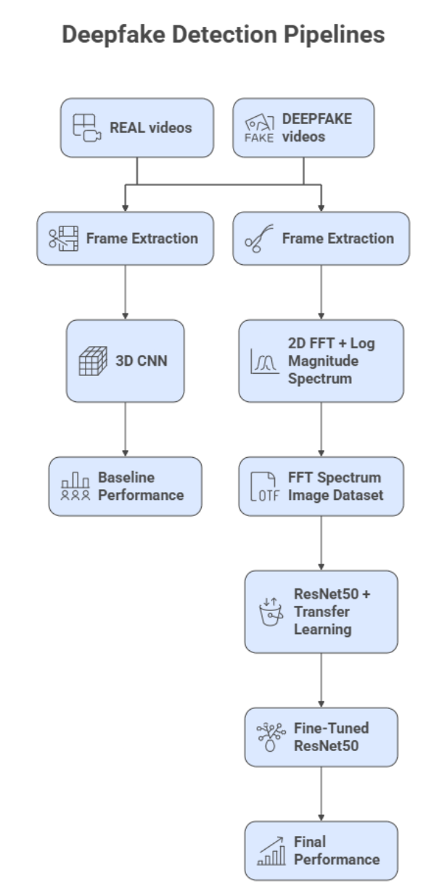
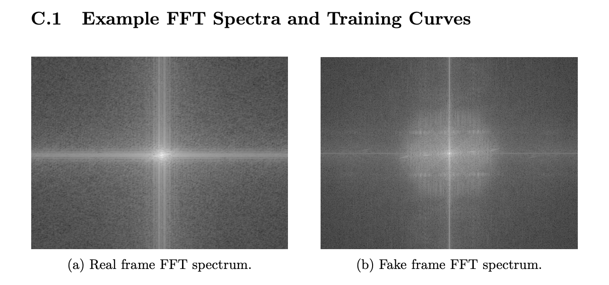
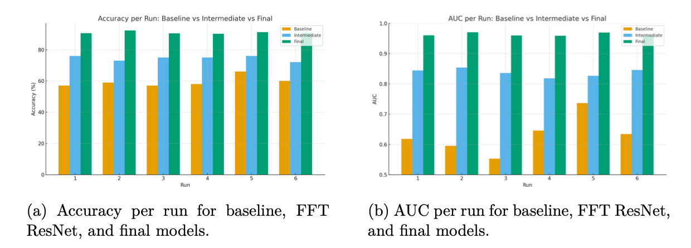
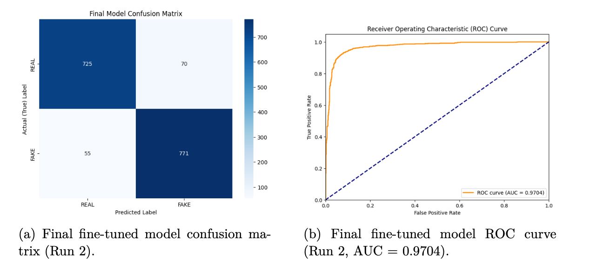

# Frequency-Domain Deepfake Video Detection

## Overview
[cite_start]This repository contains the code and research for a deepfake video detection pipeline explicitly optimized for low-latency forensic triage[cite: 3]. 

[cite_start]While most conventional detectors operate in the spatial domain and rely on pixel-level artifacts, this project explores a frequency-domain approach[cite: 3]. [cite_start]By leveraging log-magnitude Fast Fourier Transform (FFT) spectra, the model achieves high accuracy and near-real-time inference speeds, making it highly viable for rapid triage of suspicious content[cite: 4, 10].

You can read the full methodology, detailed mathematical formulations, and view the training graphs in the included [Capstone Project Report](capstone-project-report.pdf).

## Architecture & Pipeline
[cite_start]The project evaluates a three-stage progression of models[cite: 4]:



1. [cite_start]**Baseline 3D CNN:** Trained on short RGB video clips to capture spatial-temporal features[cite: 4, 183].
2. [cite_start]**Intermediate ResNet50:** Leverages transfer learning applied to log-magnitude FFT spectra[cite: 4, 213].
3. [cite_start]**Fine-Tuned ResNet50:** The final model, with the top convolutional block fine-tuned specifically for frequency-domain features[cite: 4, 223].

### Frequency Domain Representation (FFT)
[cite_start]Instead of analyzing pixel-level artifacts, the frames are converted into log-magnitude FFT spectra before classification[cite: 192, 194]:



---

## Performance & Results
[cite_start]The shift from the spatial domain to the frequency domain yielded significant performance improvements across six independent runs[cite: 93]. 

*(Note: Full classification reports and confusion matrices are available in the attached Capstone Project Report PDF).*





| Model Architecture | Accuracy | AUC Score | Median Latency (per-frame) |
| :--- | :--- | :--- | :--- |
| Baseline 3D CNN | [cite_start]57% - 66% [cite: 6] | [cite_start]0.55 - 0.74 [cite: 6] | N/A |
| FFT-based ResNet50 | [cite_start]72% - 76% [cite: 7] | [cite_start]0.82 - 0.85 [cite: 7] | N/A |
| **Fine-Tuned FFT ResNet50** | [cite_start]**90% - 92%** [cite: 8] | [cite_start]**> 0.95** [cite: 8] | [cite_start]**~2.7 ms** [cite: 9] |

## Dataset & Acknowledgements
[cite_start]The video data used to train and evaluate these models is sourced from the **FaceForensics++** dataset[cite: 5, 149]. 
* Original Dataset Repository: [ondyari/FaceForensics](https://github.com/ondyari/FaceForensics)

## Repository Structure
```text
├── .gitignore
├── README.md
├── Capstone Project Report.pdf       # Full academic report, methodology, and graphs
├── Build_and_Train_Model.ipynb       # Model definition, training, and evaluation
├── data_loader.py                    # Custom dataset loading and transformation logic
├── requirements.txt                  # Python dependencies
├── assets/                           # Readme images and diagrams
│   ├── pipeline.png
│   ├── fft_spectra.png
│   ├── performance_bars.png
│   └── roc_curve.png
└── videos/                           # Target directory for the dataset
    ├── Real_videos/
    └── Deepfakes_videos/